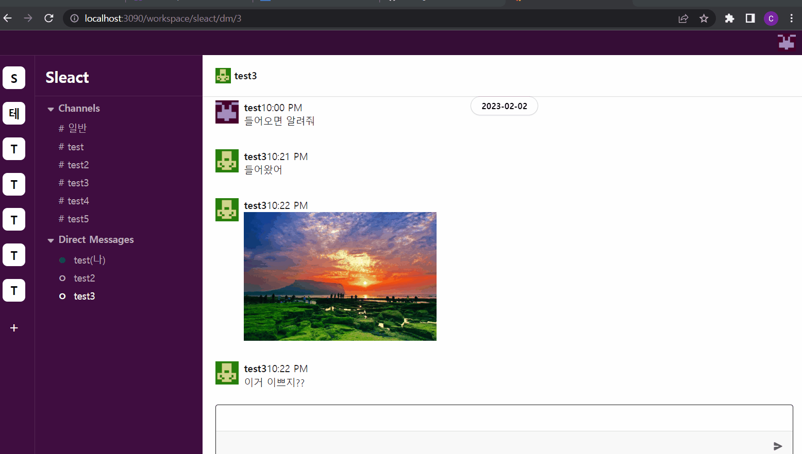
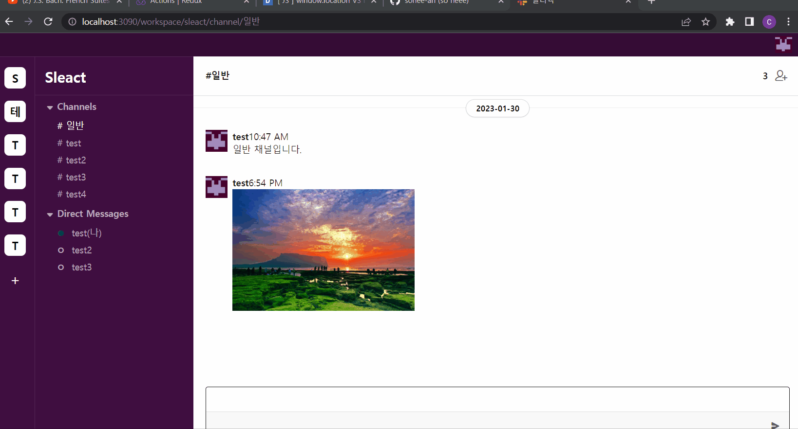

# 프로젝트 목적

socket과 리액트 타입스크립트를 사용하여 슬랙클론코딩 홈페이지 만들기

# 기술 스펙

- node.js
- typescript
- soket
- react

- nest
- DB: MYSQL

## back 
API.MD에 라우터 주소 있음

## front 
- workspace/sleact/일반 : 로그인 후 처음에는 일반으로 들어옴
- workspace와 그안에 채널들을 따로 만듬 
- dm 기능 구현 
- 채팅 기능 구현 ( 무한 스크롤)
- 채팅에 이미지업로드 기능 (드래그 드랍)

  

  

  

