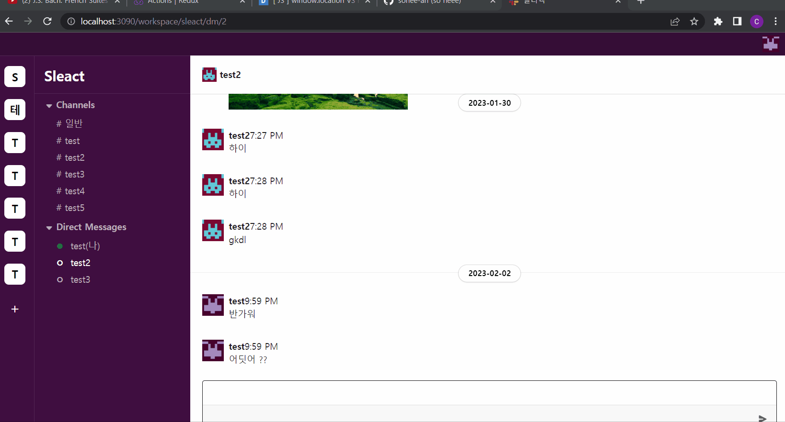

# ✨서비스 소개

## sleck_clone
socket과 리액트 타입스크립트를 사용하여 슬랙클론코딩 만들기

  
    

    

 
 

# ⚙ 기술스택

    

   

 
 

 
 

## back 
API.MD에 라우터 주소 있음

## front 
- workspace/sleact/일반 : 로그인 후 처음에는 일반으로 들어옴
- workspace와 그안에 채널들을 따로 만듬 
- dm 기능 구현 (온라인시 초록색으로 표시)
- 채팅 기능 구현 ( 무한 스크롤)
- 채팅에 이미지업로드 기능 (드래그 드랍)
- @태그로 사람을 부를 수 있으며 클릭 하면 dm으로 이동함

  

  
  
  
  - 채널생성 
  - 워크스페이스 생성
  - 채널안에 몇명 있는지 확인가능

  

